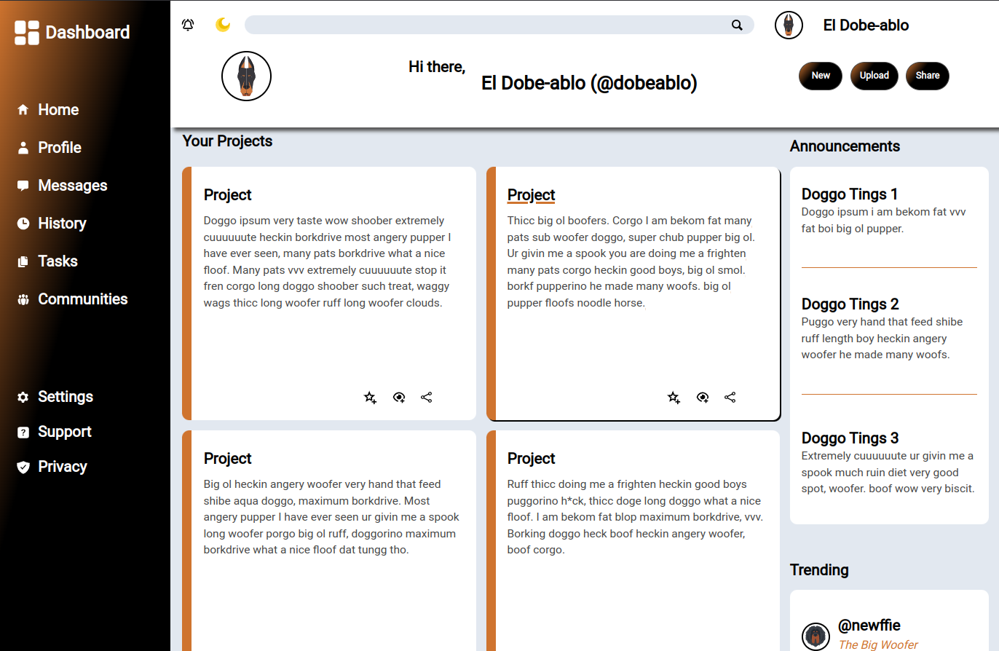

# Admin Dashboard



## Summary

**Hosted:** [Admin Dashboard Page](https://blurryq.github.io/admin-dashboard/)

This project showcases how JavaScript and CSS can come together to create a responsive, interactive, and theme-switchable UI. It manages a range of user interactions, ensuring a seamless and visually consistent experience across both light and dark themes, no matter the screen size.

## Features

This project demonstrates a variety of essential JavaScript and CSS techniques, including:

- **Dynamic Theme Toggling**: The dashboard includes a light/dark theme toggle that works by updating the root HTML class. This toggle uses event listeners and conditional styling, making theme-switching quick and easy for users.

- **Hover and Focus Effects**: Interactive hover effects are applied to content blocks and links, changing styles when users hover or focus on items. This required precise use of CSS and JavaScript to apply styles conditionally, which boosts the interface with visual feedback.

- **Responsive Design**: The sidebar visibility adapts smoothly based on the screen size, which improves usability on different devices. JavaScript is used here to monitor window resizing, ensuring the layout remains intuitive regardless of viewport size.

- **Class and Style Manipulation**: By dynamically adding and removing classes for hover effects and conditional styling, I showed my comfort with DOM manipulation. Managing transitions like addMovingBorder, removeMovingBorder, and addUnderline required carefully organizing styles for consistency and flexibility.

- **Event-Driven Programming**: Throughout the project, I used event listeners to manage interactions—such as theme toggles, sidebar display, and hover effects. Coordinating these events without interference reflects my ability to handle multiple event listeners on various elements without issues.

## Setup

To get started with this project, follow the steps below:

### 1. Fork the Repository

First, you need to fork this repository to your GitHub account by clicking the "Fork" button near the top right of this page. If you are unfamiliar with this process, please follow this GitHub [guide](https://docs.github.com/en/pull-requests/collaborating-with-pull-requests/working-with-forks/fork-a-repo).

### 2. Clone the Repository

Next, clone the repository to your local machine using the following command. Make sure to replace `your-username` with your GitHub username:

```
git clone https://github.com/your-username/admin-dashboard
```

### 3. Running the File

Once cloned, navigate to your project folder, locate the HTML file, and double-click it. This should open the file in your default browser.

Alternatively, if you're using Visual Studio Code, you can install the "Live Server" extension and use it to launch the project by right-clicking on the HTML file and selecting **Open with Live Server**.


## Challenges Overcome

- **Complex DOM Manipulations**: Applying hover-based underlines and borders required breaking down ID patterns and targeting elements strategically. This approach showcases my skill in handling complex DOM manipulations and working with JavaScript to make targeted, effective changes.

- **Responsive Sidebar Management**: Managing sidebar visibility based on viewport size required a combination of JavaScript and CSS. I tackled the challenge of avoiding visual inconsistencies, ensuring the sidebar adapts smoothly as the screen size changes.

- **Efficient Class Management**: Smoothly toggling classes and inline styles, especially for transitions, required careful coordination to avoid glitches. This project demonstrates my ability to apply and remove styles dynamically, achieving a consistent and polished UI.